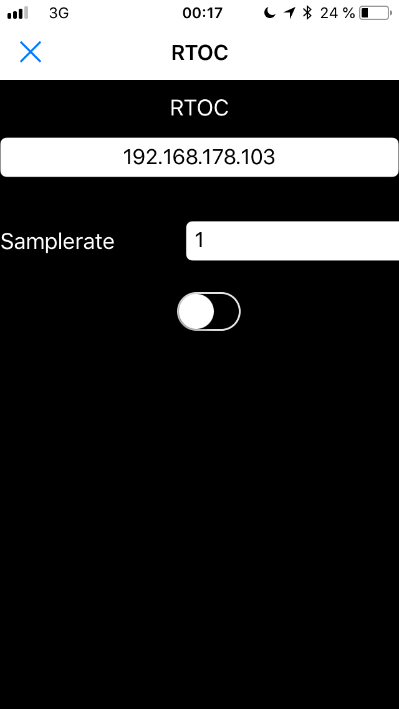
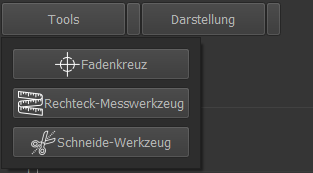

# RealTime OpenControl (RTOC)
### Version: 1.7

# Installation
## With pip3 (Recommended)
> pip3 install RTOC
> python3 -m RTOC [-s] [-r 'REMOTEADRESSE']

## From source
Klone RTOC in ein beliebiges Verzeichnis und wechsle in das Verzeichnis:

RTOC mit GUI starten:
> python3 RTOC.py

RTOC nur Logger-Server starten:
> python3 RTOC.py -s

RTOC im Remote-Modus starten (NetWoRTOC-Plugin im Vordergrund):
> python3 RTOC-py -r 'REMOTEADRESSE'

RealTime OpenControl ermöglicht eine geräteübergreifende Messaufzeichnung.
Außerdem kann man mit dem integrierten Python-Skript-Editor auf die Messdaten und Geräte zugreifen und mit diesen interagieren. Somit lassen sich langsame Regelungen zwischen mehreren Geräten realisieren.
Z.B.: Temperaturmessung mit Multimeter (mit USB-Anschluss) und Regelung eines Heizelements auf eine Solltemperatur. Ideal zum Aufzeichnen, Testen und Optimieren von Regelungen.

Eignet sich auch für Custom-HomeAutomation (z.B.: auf Raspberry Pi oder HomeServer) mit maximaler Flexibilität und Anpassbarkeit. Dabei kann über TCP auf den RTOC-Server zugegriffen werden. Dadurch können auch Plugin-Funktionen ausgeführt und Parameter angepasst werden.
Somit lässt sich der Logger auch einfach als Python-Remote-Steuerung verwenden. Fast ebenso viele Funktionen bietet der integrierte Telegram-Bot.

Die Einbindung neuer Geräte ist einfach möglich:
- Als Python-Plugin für RTOC (v.a. für lokale Geräte)
- Als TCP-Client (v.a. für Netzwerkgeräte)
  - Die TCP-Schnittstelle stellt hierbei alle Funktionen bereit, die das RTOC-Backend bereitstellt
(für weitere Infos siehe Wiki)

Steuerung der Geräte ist noch einfacher:
- Direkt in der GUI
- Remote über das Netzwerk bzw. Internet mit TCP
- Mit Telegram-Bot

### Standart/Beispiel Plugins:
- Funktionsgenerator: Erzeugt Sinus, Square, Sawtooth, Random, AC, DC
- System: Zur Aufzeichnung vieler Systemvariablen (CPU, Memory, Network,...)
- Octoprint: Aufzeichnung für 3D-Drucker
- DPS5020: Netzgerät-Aufzeichnung und Steuerung (evtl. auch DPS5005, ...)
- HoldPeak VC820: Multimeter Messaufzeichnung (wahrsch. auch andere VC820)
- NetWoRTOC: Steuerung und Datenaustausch zwischen mehreren RTOC's im Netzwerk

Die Oberfläche hat erweiterte Darstellungsoptionen und stellt verschiedene Messtools für den Plot bereit.

## Funktionsübersicht
- Plugins und TCP-Clients:
  - können Daten als Stream(=append) oder Plot(=replace) senden
  - können Events senden
- Remotesteuerung per TCP oder Telegram-Bot:
  - Ermöglicht reine Serveranwendungen z.B. auf Raspberry Pi
  - Kompletter Zugriff per Telegram-Bot
- Skripte:
  - Multi-Tab Skript-Editor
  - Der Nutzer kann während der Laufzeit mit den Signalen und Plugins interagieren:
    - Pluginfunktionen ausführen oder Pluginparameter setzen
    - Signale bearbeiten, neue Signale erzeugen, zuschneiden, überlagern, ...
    - Skalieren, verschieben von Signalen
  - Mehrere Skripte parallel laufen lassen
- Messwerkzeuge
- Plotstile anpassen und speichern
- Session speichern und laden
- Mehrere Plots erzeugen
- Im Hintergrund laufen
- Daten importieren und exportieren

## [Alles weitere steht im Wiki](https://git.kellerbase.de/haschtl/kellerlogger/wikis/RealTime-OpenControl-(RTOC))
### Screenshots - siehe unten

## Python3 Paket-Abhängigkeiten
- numpy
- pyqt5
- pyqtgraph
- markdown2
- xlsxwriter
- scipy
- qtmodern
- python-telegram-bot
- matplotlib
- requests
- python-nmap

Optional für Plugins:
- pip3 install minimalmodbus (DPS5020)

## Externe Bibliotheken und Skripte
- [Jsonsocket von mdebbar](https://github.com/mdebbar/jsonsocket)
- [Taurus PyQtGraph](https://github.com/taurus-org/taurus_pyqtgraph.git)
- [ImportCode Script von avtivestate.com](http://code.activestate.com/recipes/82234-importing-a-dynamically-generated-module/)
- [VC820Py von adnidor (für das HoldPeak_VC820 Plugin)](https://github.com/adnidor/vc820py)

Alle Icons, die in dieser Software (inklusive Plugins) benutzt werden, werden freundlicherweise zur Verfügung gestellt von [Icons8](www.icons8.com)

## Beispiel TCP Client für Pythonista (iOS)

## MultiWindow

## Crosshair-Tool

## Cutting-Tool

## Rechteck-Messtool

## Plotstile anpassen

## Plot-Tools-DropDown

## Plot-Ansicht-Dropdown

## Signal

## Plot

## Scripte

