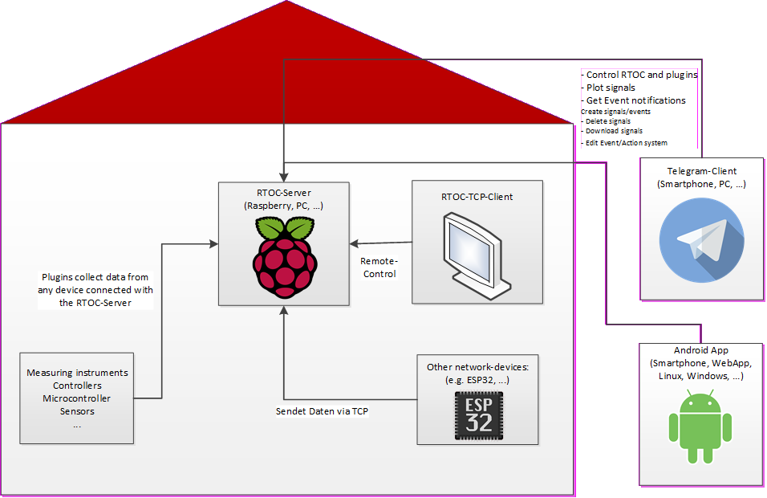
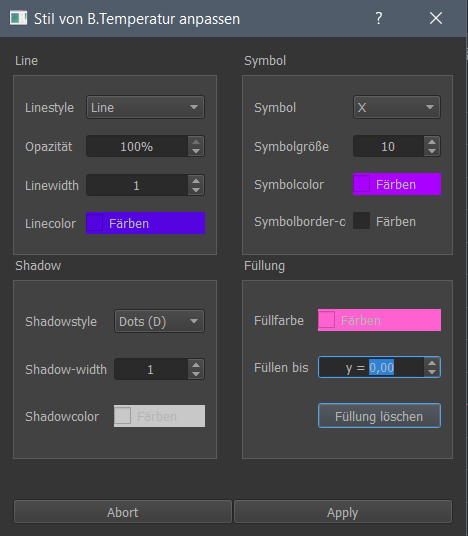
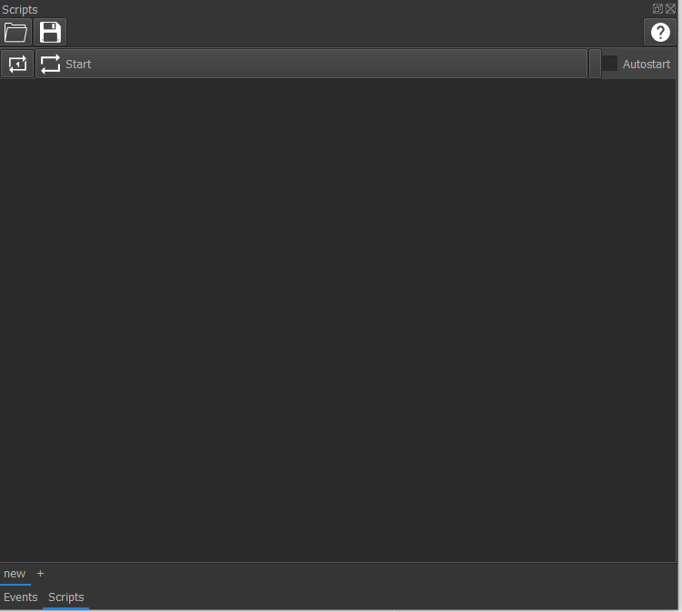

## Important: If you installed RTOC with `pip3`, you can now choose between different dependencies. If you need the graphical user interface, you need to install `pip3 install RTOC[ALL]`. Now you can install RTOC on a RaspberryPi with pip. Installation failed due to missing python3-qt5 package in pip. If you need the GUI on a RaspberryPi, you need to install PyQt5 with `apt install python3-qt5`.

# RealTime OpenControl (RTOC)

### Version 2.0 (PRERELEASE)

[Documentation](https://github.com/Haschtl/RealTimeOpenControl/wiki) !!! NEW LINK !!!

RealTime OpenControl is a simple way for real-time data recording, visualization and editing.

RTOC is made for communication with different devices (IoT) in a network or local sensors or devices providing data. It collects Data from any source and provides easy and intuitive user interaction. The simplest way is, to run RTOC with the user-frontend. But it can also run a HTML-Server providing plots and events. This is the best way to view the data, if RTOC is running on screen-less devices, like a Raspberry Pi. And in any other case, you can get full access and control of RTOC with a simple Telegram-Bot all over the world, without many configurations. This bot is also capable of sending messages or warnings, if events are triggered. Read more about Events later on.

There are different ways to access data on an RTOC-Server:

- From GUI (PyQT5) (full access)
- From another RTOC-Server with TCP (partial access)
- From any device with a Telegram-Bot (full access)
- From any device with an HTML-website (only viewable)
- From any device with PostgreSQL-Database (only access to data, no controlling of RTOC)

### Possible applications

- General long time data recording and automation due to postgreSQL integration
- Central measurement data recording of laboratory instruments with PC connection (e.g. power supply unit, multimeter, sensors, microcontroller)
- Central recording of measurement data from Internet devices (e.g. mobile weather stations, drones, smartphones)
- Remote monitoring and control of processes and devices with PC and Smartphone (Telegram) (e.g. 3D printing, heating, Custom-SmartHome)
- Controlling between several devices (e.g.: power regulation of a power supply unit on the temperature sensor of a multimeter)
- Decentralized data recording (e.g. on Raspberry) and access via network connection (smart projects)
- Fun projects like controlling a LED with Telegram

### Recording data and events

Basis for a RTOC-Server are plugins, which collect data in any way and provide their functions and parameters. These plugins are represented by simple python-plugins, which can be downloaded from the [RTOC-plugin-repository](https://github.com/Haschtl/rtoc-plugins) for specific devices. You can also write your own plugins for it. If you want to publish your plugin in my repository, just send me a message.

Every plugin can send measurements and events to the RTOC-Server.

A measurement represents the collected data. Events occur in certain conditions (for example if a measured value is higher than a limit value) and can trigger actions, which will be performed after the event. Also these events can be used to trigger PushNotifications in Telegram.

### GUI

You can run the GUI with "python3 -m RTOC"

The GUI offers a lot of tools:

- Enable/disable devices
- Access to optional device-GUIs
- View and edit measurements in a lot of different ways
- View, filter and delete events
- Edit global events and actions
- Download devices from RTOC-repository
- Write and execute python-scripts, which can interact with the devices.
- Connect to a remote RTOC-Server and view/delete measurements and events and access devices of remote RTOC-Server

### No GUI

In some cases you don't want to run the GUI (e.g. raspberry). Then you can still configure RTOC in a terminal: `python3 -m RTOC.RTLogger -c`

If you just want to run the TCP-Server after configuration, you can do this with `python3 -m RTOC.RTLogger`. The best way, to run this code on embedded devices, is, to setup a systemd-service for automated startup. But you can also run/stop RTOC in background with 'python3 -m RTOC.RTLogger -s start/stop'.

If you want to start the HTML server on port 8050, you need to run it with 'python3 -m RTOC.RTLogger -w'.

## Getting Started

RTOC is written in Python 3.  Tested on Windows and Linux.

Python3 (and pip3) need to be installed on the System. But you can also download the Stand-Alone-Builts for Windows and Linux below.
RTOC can be installed and used in different ways:
- Installation and use with PostgreSQL-Server (recommended for embedded)
- Installation without PostgreSQL-Database (recommended for simple-usage)
- Installation with builds (Linux/Windows)
- Installation from source

!!! MORE INFORMATION LINK !!!

### Wiki
[Read the Wiki for full documentation](https://github.com/Haschtl/RealTimeOpenControl/wiki) !!! NEW LINK !!!

### Default/Example Plugins:

- function generator: generates sine, square, sawtooth, random, AC, DC

You can get more plugins from the [RTOC-plugin-repository](https://github.com/Haschtl/rtoc-plugins). Simply follow the steps described in the [documentation](https://github.com/Haschtl/RealTimeOpenControl/wiki/RTOC-Repo) !!! NEW LINK !!!:
- System: For recording many system variables (CPU, Memory, Network,...)
- Octoprint: Recording of 3D printers
- DPS5020: power supply unit recording and control (possibly also DPS5005, ...)
- HoldPeak VC820: Multimeter Measurement Recording (also other VC820)
- ...

### First GUI-Run

The graphical user interface of RTOC offers a wealth of functions for data display and processing.

- measuring tools
- Customize and save plot styles
- Save and load session
- Create multiple plots
- Run in the background
- Import and export data
- Scripts:
  - Multi-Tab Script Editor
  - The user can interact with the signals and plugins during runtime:
    - Execute plugin functions or set plugin parameters
    - Edit signals, create new signals, crop, overlay, ...
    - Scaling, shifting of signals
    - Run multiple scripts in parallel

[Complete GUI-tutorial here.](https://github.com/Haschtl/RealTimeOpenControl/wiki/GUI) !!! NEW LINK !!!

### Write simple Python-Plugin

Python plugins are integrated into RTOC and can be used to

- send data as stream(=append) or plot(=replace) to RTOC
- send events

Plugins can **not** access all measurements. This can be done with a TCP connection to RTOC.

[Example-Plugins here.](https://github.com/Haschtl/RealTimeOpenControl/wiki/PlugIns) !!! NEW LINK !!!

### Simple local TCP-Datastream

TCP clients can establish a connection to the RTOC server on the same computer or in the network (check firewall settings). With the necessary port shares on the router and dynamic DNS, the RTOC server can also be accessed from the Internet.

TCP communication takes place with JSONs, which allows communication in all programming languages and also, for example, with an ESP8266/ESP32 microcontroller. This connection can also be end-to-end-encrypted with AES.

The client can

- send data as stream(=append) or plot(=replace) to RTOC
- send events
- access all measurement data and events of the RTOC-server
- access all RTOC-server functions
- access all RTOC-server plugin functions and parameters

The connection between RTOC server and client can be encrypted end-to-end (DES) with a password.

[Example for TCP here.](https://github.com/Haschtl/RealTimeOpenControl/wiki/clientCommunication) !!! NEW LINK !!!

### Include Telegram-messanger

[Tutorial for Telegram here.](https://github.com/Haschtl/RealTimeOpenControl/wiki/telegram) !!! NEW LINK !!!

## Screenshots

#### MultiWindow

#### Crosshair-tool

#### Cutting-tool

#### Rectangle-measure-tool

#### Plotstyle-window

#### Plot-View-Dropdown

#### Signal

#### Plot

#### Scripts

## Built With

* [cx_freeze](https://anthony-tuininga.github.io/cx_Freeze/)

## External libraries and scripts

- [Jsonsocket from mdebbar](https://github.com/mdebbar/jsonsocket)
- [Taurus PyQtGraph](https://github.com/taurus-org/taurus_pyqtgraph.git)
- [ImportCode script from avtivestate.com](http://code.activestate.com/recipes/82234-importing-a-dynamically-generated-module/)
- [VC820Py from adnidor (for HoldPeak_VC820 plugin)](https://github.com/adnidor/vc820py)
- [PyQt5 CSV-Editor](https://python-forum.io/Thread-Read-Write-CSV-Qt5)

All icons used in this software (including plugins) are kindly provided by [Icons8](www.icons8.com)

## Contributing

Please read [CONTRIBUTING.md](https://gist.github.com/PurpleBooth/b24679402957c63ec426) for details on my code of conduct, and the process for submitting pull requests to me.

## License

This project is licensed under the  **GNU General Public License v3.0** - see the [LICENSE](LICENSE) file for details
