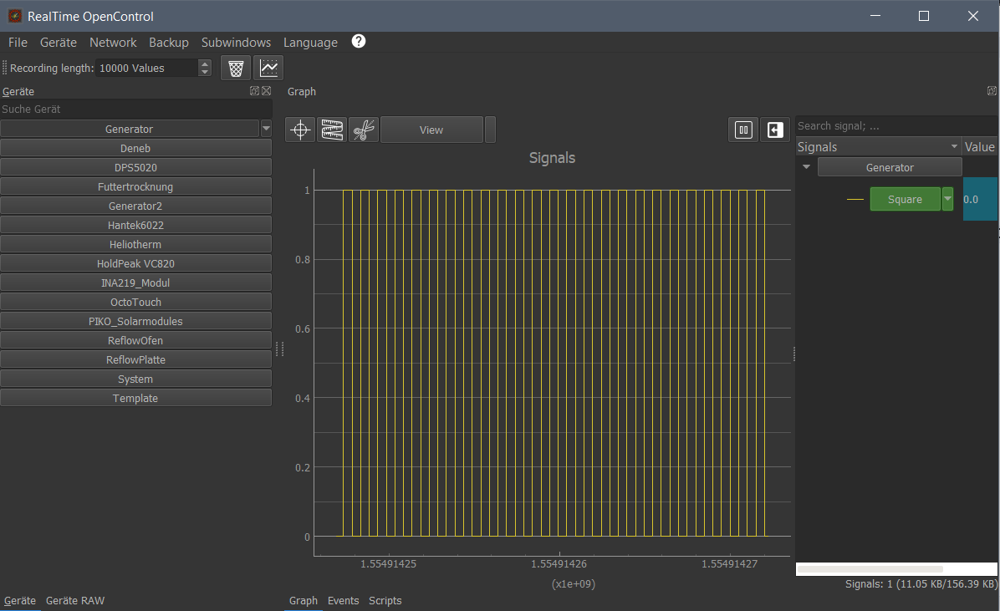
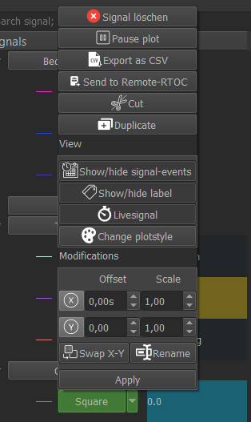

# RealTime OpenControl (RTOC)

### Version 1.9.9

[**This README is available in GERMAN here.**](misc/README_german.md)

[Documentation](https://github.com/Haschtl/RealTimeOpenControl/wiki)

RealTime OpenControl is a simple way for real-time data recording, visualization and editing.

RTOC is made for communication between different devices (IoT) in a network. You can also access it with a Telegram-Bot.

There are different ways to access data on an RTOC-Server:

- From another RTOC-Server with TCP
- From any device with a Telegram-Bot (limited access)
- From any device with an HTML-website (only viewable)

### Possible applications

- Central measurement data recording of laboratory instruments with PC connection (e.g. power supply unit, multimeter, sensors, microcontroller)
- Central recording of measurement data from Internet devices (e.g. mobile weather stations, drones, smartphones)
- Remote monitoring and control of processes and devices with PC and Smartphone (Telegram) (e.g. 3D printing, heating, Custom-SmartHome)
- Controlling between several devices (e.g.: power regulation of a power supply unit on the temperature sensor of a multimeter)
- Decentralized data recording (e.g. on Raspberry) and access via network connection (smart projects)
- Fun projects like controlling a LED with Telegram

### Recording data and events

Basis for a RTOC-Server are "devices", which collect data in any way and provide their functions and parameters. "Devices" are simple python-scripts.

These "devices" can send measurements and events to the RTOC-Server.

A measurement represents the collected data. Events occur in certain conditions (for example if a measured value is higher than a limit value) and can trigger actions, which will be performed after the event. Also these events can be used to trigger PushNotifications in Telegram.


### GUI



You can run the GUI with "python3 -m RTOC"

The GUI offers a lot of tools:

- Enable/disable devices
- Access to optional device-GUIs
- View and edit measurements in a lot of different ways
- View, filter and delete events
- Edit global events and actions
- Download devices from RTOC-repository
- Write and execute python-scripts, which can interact with the devices.
- Connect to a remote RTOC-Server and view/delete measurements and events and access devices of remote RTOC-Server


### No GUI

In some cases you don't want to run the GUI (e.g. raspberry). Then you can still configure RTOC in a terminal: `python3 -m RTOC.Console`

If you just want to run the TCP-Server after configuration, you can do this with `python3 -m RTOC -s start/stop`


## Getting Started

RTOC is written in Python 3.  Tested on Windows and Linux.

Python3 (and pip3) need to be installed on the System. But you can also download the Stand-Alone-Builts for Windows and Linux below.

### Installing with Python3 (recommended)

RTOC is available in the Python package manager PIP:

```
pip3 install RTOC
```

This will download the basic RTOC without the dependencies needed for the GUI, Telegram and the Webserver. The basic RTOC is enough for running RTOC on embedded devices.

There are also different variations available to install:

```
pip3 install RTOC[Webserver]
pip3 install RTOC[GUI]
pip3 install RTOC[Telegram]
pip3 install RTOC[ALL]
```


After installing you can run RTOC with

```
// local RTOC-instance including GUI
python3 -m RTOC

// local RTOC-instance without GUI (only TCP-Server, [HTTP-Server, Telegram-Bot])
python3 -m RTOC -s start/stop

// local RTOC-Configuration from Console
python3 -m RTOC.Console

// remote RTOC-instance with GUI
python3 -m RTOC -r <ADRESS>
```

After the first start RTOC creates a directory for user-devices, temporary user data and settings.

```
user@rtoc-server:~$ ls .RTOC
config.json  // Settings for RTOC
devices/ 	 // Directory for user-plugins
plotStyles.json // Custom plotstyles for signals are stored in this file
autorun_devices // Contains devices, which will start with RTOC
globalActions.json // Contains global definitions of actions
globalEvents.json // Contains global definitions of events
```

### Installing with Builds (not newest version!)

Download the latest release builds for Windows (soon also Linux) here.

Extract the .zip file into a directory. RTOC is started by double-clicking on "RTOC.exe". Alternatively via command line

```
// local RTOC-instance including GUI
./RTOC
// local RTOC-instance without GUI (only TCP-Server, [HTTP-Server, Telegram-Bot])
./RTOC -s start
// remote RTOC-instance with GUI
./RTOC -r <ADRESS>
```

### Install manually

To use the basic RTOC, the following dependencies must be installed

```python
pip3 install numpy pycryptdomex requests python-nmap whaaaaat
```

If you want to use the GUI you must also install the following packages

```python
pip3 install pyqt5 pyqtgraph markdown2 xslxwriter scipy pandas ezodf pyGithub
```

If you want full functionality, then you still need the following packages

```
pip3 install python-telegram-bot matplotlib bokeh
```

You can use different stylesheets if you want. Just install one of these with pip:
'QDarkStyle', 'qtmodern', 'qdarkgraystyle'.


The RTOC repository can then be cloned with

```shell
git clone git@github.com:Haschtl/RealTimeOpenControl.git
```

Now you can run RTOC. Important: To run RTOC, you need to call it as a module. So, do not enter the folder containing RTOC.py

```shell
cd RealTimeOpenControl
// local RTOC-instance including GUI
python3 -m RTOC
// local RTOC-instance without GUI (only TCP-Server, [HTTP-Server, Telegram-Bot])
python3 -m RTOC -s
// remote RTOC-instance with GUI
python3 -m RTOC -r <ADRESS>
```

## First steps


### Wiki
[Read the Wiki for full documentation](https://github.com/Haschtl/RealTimeOpenControl/wiki)

### Default/Example Plugins:

- function generator: generates sine, square, sawtooth, random, AC, DC

You can get more plugins from the [RTOC-plugin-repository](https://github.com/Haschtl/rtoc-plugins). Simply follow the steps described in the [documentation](https://github.com/Haschtl/RealTimeOpenControl/wiki/RTOC-Repo):
- System: For recording many system variables (CPU, Memory, Network,...)
- Octoprint: Recording of 3D printers
- DPS5020: power supply unit recording and control (possibly also DPS5005, ...)
- HoldPeak VC820: Multimeter Measurement Recording (also other VC820)
- ...


### First GUI-Run

The graphical user interface of RTOC offers a wealth of functions for data display and processing.

- measuring tools
- Customize and save plot styles
- Save and load session
- Create multiple plots
- Run in the background
- Import and export data
- Scripts:
  - Multi-Tab Script Editor
  - The user can interact with the signals and plugins during runtime:
    - Execute plugin functions or set plugin parameters
    - Edit signals, create new signals, crop, overlay, ...
    - Scaling, shifting of signals
    - Run multiple scripts in parallel

[Complete GUI-tutorial here.](https://github.com/Haschtl/RealTimeOpenControl/wiki/GUI)

### Write simple Python-Plugin

Python plugins are integrated into RTOC and can be used to

- send data as stream(=append) or plot(=replace) to RTOC
- send events

Plugins can **not** access all measurements. This can be done with a TCP connection to RTOC.

[Example-Plugins here.](https://github.com/Haschtl/RealTimeOpenControl/wiki/PlugIns)

### Simple local TCP-Datastream

TCP clients can establish a connection to the RTOC server on the same computer or in the network (check firewall settings). With the necessary port shares on the router and dynamic DNS, the RTOC server can also be accessed from the Internet.

TCP communication takes place with JSONs, which allows communication in all programming languages and also, for example, with an ESP8266/ESP32 microcontroller. This connection can also be end-to-end-encrypted with AES.

The client can

- send data as stream(=append) or plot(=replace) to RTOC
- send events
- access all measurement data and events of the RTOC-server
- access all RTOC-server functions
- access all RTOC-server plugin functions and parameters

The connection between RTOC server and client can be encrypted end-to-end (DES) with a password (min. 8 characters).

[Example for TCP here.](https://github.com/Haschtl/RealTimeOpenControl/wiki/clientCommunication)

### Include Telegram-messanger

[Tutorial for Telegram here.](https://github.com/Haschtl/RealTimeOpenControl/wiki/telegram)

## Screenshots

#### MultiWindow


#### Crosshair-tool


#### Cutting-tool


#### Rectangle-measure-tool


#### Plotstyle-window


#### Plot-View-Dropdown


#### Signal



#### Plot


#### Scripts


## Built With

* [cx_freeze](https://anthony-tuininga.github.io/cx_Freeze/)

## External libraries and scripts

- [Jsonsocket from mdebbar](https://github.com/mdebbar/jsonsocket)
- [Taurus PyQtGraph](https://github.com/taurus-org/taurus_pyqtgraph.git)
- [ImportCode script from avtivestate.com](http://code.activestate.com/recipes/82234-importing-a-dynamically-generated-module/)
- [VC820Py from adnidor (for HoldPeak_VC820 plugin)](https://github.com/adnidor/vc820py)
- [PyQt5 CSV-Editor](https://python-forum.io/Thread-Read-Write-CSV-Qt5)

All icons used in this software (including plugins) are kindly provided by [Icons8](www.icons8.com)

## Contributing

Please read [CONTRIBUTING.md](https://gist.github.com/PurpleBooth/b24679402957c63ec426) for details on our code of conduct, and the process for submitting pull requests to us.

## License

This project is licensed under the  **GNU General Public License v3.0** - see the [LICENSE](LICENSE) file for details
