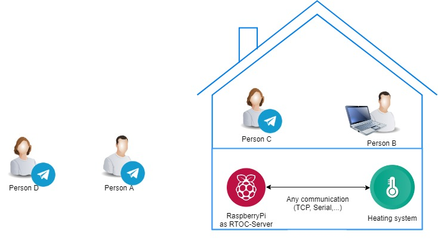

********************************
Example: Embedded
********************************

This example uses the following RTOC-features:

- PostgreSQL-database for long-time logging
- Telegram-Bot with different permissions
- Remote-Websocket connection
- Automation (Event-Action-System)

Introduction
===============

This example will show, how to connect a heatpump or any other heating system with an RTOC-server. This will allow remote control and long-time-measurements. (And events,... all RTOC-Features)

Person A and B are administrators of the RTOC-server. Person A from outside the local network using the Telegram-Bot and Person B in the same network with the RTOC-server using a PC.

Person C is a user, who just wants to control the heating system (Smart Home). He/she will be able to set the room-temperature or any other custom functions with the telegramBot.

Person D is just interested in your heating's long-time-measurements (e.g. a technician) and has access with the telegramBot.

Prerequirement
=================
- Raspberry Pi
- Heating system/heat pump with remote control capability
- RTOC-Plugin to interact with the heating system (e.g. Heliotherm from RTOC_repo)

Setup
=================

1. Install RTOC: :ref:`Installation`
2. Setup PostgreSQL Database: :ref:`Long-time measurements in postgreSQL database (optional)`
3. Setup Telegram-Bot: :ref:`Telegram-Bot setup`
4. You should also set a websocket-password in :ref:`config.json`
5. Download/program a plugin. Refer to :ref:`Plugin repository` and :ref:`Writing Plugins`.
6. Add the plugin to :ref:`autorun_devices`.
7. Start RTOC with `python3 -m RTOC`. Use `loggerServer.py` to run RTOC as a service on linux.

Remote access
=================

Remote-Websocket-Client (Person B)
----------------------
Person B uses a computer with RTOC installed. Have a look at the :doc:`/GUI`-Documentation for more information. He can view all of the data in the database of the RTOC-server and has access to all functions and parameters from the heating system. He can manipulate the data with the RTOC-GUI.
Person B can instead also use the RTOC_Remote Android App

Admin-Telegram-Client (Person A)
----------------------
Person A uses the Telegram-Bot to access the heating system. He has also access to all functions and parameters from the heating system and can view and edit all of the data. He can also modify the event-action (automation).

Custom-Telegram-Client (Person C)
----------------------
Person C just wants to set the room temperature for example. But does not want to use the complexe structure of the Telegram-Bot to do this (Devices->Heatpump->Functions->SetTemp). Therefore the telegram administators can set the permissions for Person C to 'custom'. Then Person C will only see shortcuts, which have been created for only this user. This can be done in two ways:
1. Set the permission of Person C to 'Write' and create shortcuts for the desired functions/parameters and change the permission to 'Custom' afterwards.
2. Edit the client-shortcuts in :ref:`telegram_clients.json`.

Read-Telegram-Client (Person D)
----------------------
Person D just wants to view the measurements. Therefore an administrator can set his permission to 'Read'.