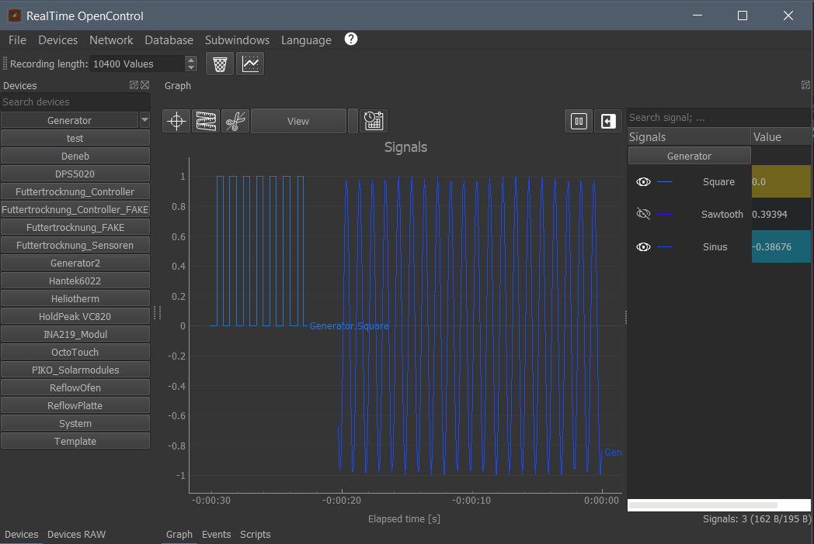
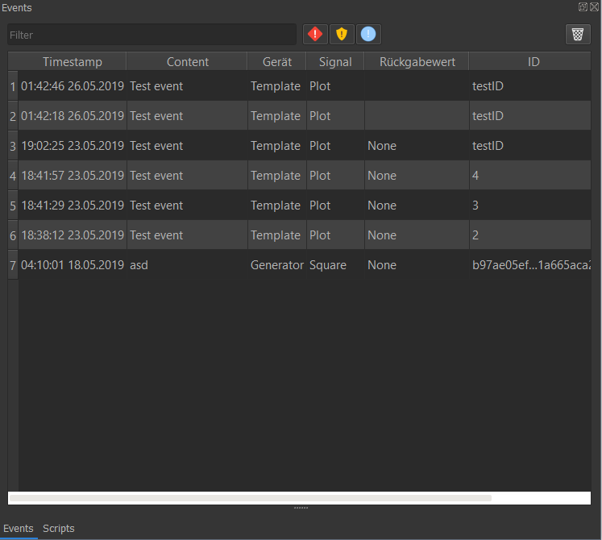

********************************
Graphical user interface
********************************

You can use the GUI to control your plugins, manipulate your measurements, try scripts, import data and configure your settings.
You can also view and control RTOC-servers remotely and subscribe to signals, which will then be casted to your device.

Titlebar
========================================
Systembar-structure
::
  Systembar
  ├── File
  │   ├── Load session
  │   ├── Save session
  │   ├── Import data
  │   ├── Export data
  │   ├── Minimize to system tray
  │   ├── Settings
  |   ├── Quit
  ├── Devices
  │   ├── Add/Remove devices
  ├── Network
  │   ├── Websocket-Server
  │   ├──   ├── Active
  │   ├──   ├── Password-Protection
  │   ├──   ├── Port: 5050
  │   ├── Telegram-Bot
  │   ├──   ├── Active
  │   ├──   ├── Bot-Token
  │   ├── Connect to remote host
  │   ├──   ├── New host
  │   ├──   ├── ...
  │   ├── Active connections
  │   ├──   ├── ...
  │   ├── Update-Rate: 1Hz
  │   ├── Search RTOC-Server
  ├── Database
  │   ├── Save local data in database
  │   ├── Reset local data with data from database
  │   ├── Export database
  ├── Subwindows
  │   ├── Devices
  │   ├── Plugins
  │   ├── Script
  │   ├── Events
  │   ├── DevicesRAW
  ├── Language
  │   ├── German
  │   ├── English
  ├── Help
  │   ├── Clear cache
  │   ├── RTOC Help
  │   ├── Plugin-repository
  │   ├── Check for updates
  │   ├── About

**Subtitlebar**

- Number-Edit for local recordLength
- Delete data: Deletes all existing data.
- Open new plot window. You can simply drag'n'drop signals from one window into another.

Device Widget
========================================
The device widget (left) holds all plugins. Each plugin is represented by a button. You can start/stop plugins with these buttons. If the plugin has a GUI and ``smallGUI`` is True, the gui will be available as a button-dropdown.

Signal Widget
========================================
The signal widget (right) hold all signals. You can toggle each signal by clicking it (red=hidden, green=visible).
Next to the button is the latest value.

Each signal also has a dropdown-menu

.. image:: ../screenshots/signalWidget.png

Check out each menu-entry by yourself, please.

Event Widget
========================================

The event widget shows a list with all events. You can filter the events by text or hide specific priorities. On the right top is a button to delete all events.

DevicesRAW Widget
========================================

This widget holds a list with all plugin functions and parameters

Script Widget
========================================

.. image:: ../screenshots/scriptWidget.png

This widget is a simple text-editor for scripts.
If you want to learn more about scripts, check out :doc:`SCRIPT`.

Run scripts in GUI
========================================
Click on one of the buttons at the top of this widget to run the code either once or repeated.

You can also load/save scripts from/to file.

At the right top is a help window with lists for all signals, parameters and functions.

Trigger-System
---------------------------------

Scripts are executed in two different ways (can be selected from the "Start" button's drop-down menu in the ScriptWidget):

- Samplerate-Triggered: script is executed periodically
- Signal-Triggered: Script is executed, if a new signaldata is received. You can select multiple trigger-signals. In this case, the latest xy-pairs of the triggered signals can still be modified.

Settings Widget
========================================

This widget can modify the :ref:`config.json`

Import/Export signals/sessions
========================================

Import session
---------------------------------

1. Open "File"->"Load session" in the menubar
2. Select a file you want to import

or

1. Drag'n'Drop a file or copied data into RTOC

Import XLSX, MATLAB, CSV
---------------------------------

On the left side is the data-table. You can modify it to your needs.

On the right side you can define signals, that will be taken from the data-table.
1. Click (+) to add a new signal.
2. Set a signal and devicename (not needed)
3. Select columns for X and Y data. If X-Column is 0, X-data will be generated automatically
4. The color on the right of each signal indicates, if this signal can be imported (mouse-over gives more information on failure)
5. Click "Import data" to load the signals to RTOC. Invalid signals will be skipped

Remote-control via Websocket
========================================

You can connect to any remote RTOC in the 'Network'-menu of the :ref:`Titlebar`.

Plugin-Downloader
========================================

This tool can automatically download, update and remove signals from the :ref:`Plugin repository`.
