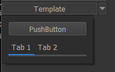
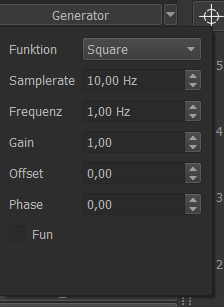
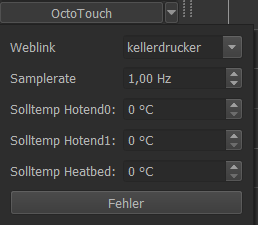
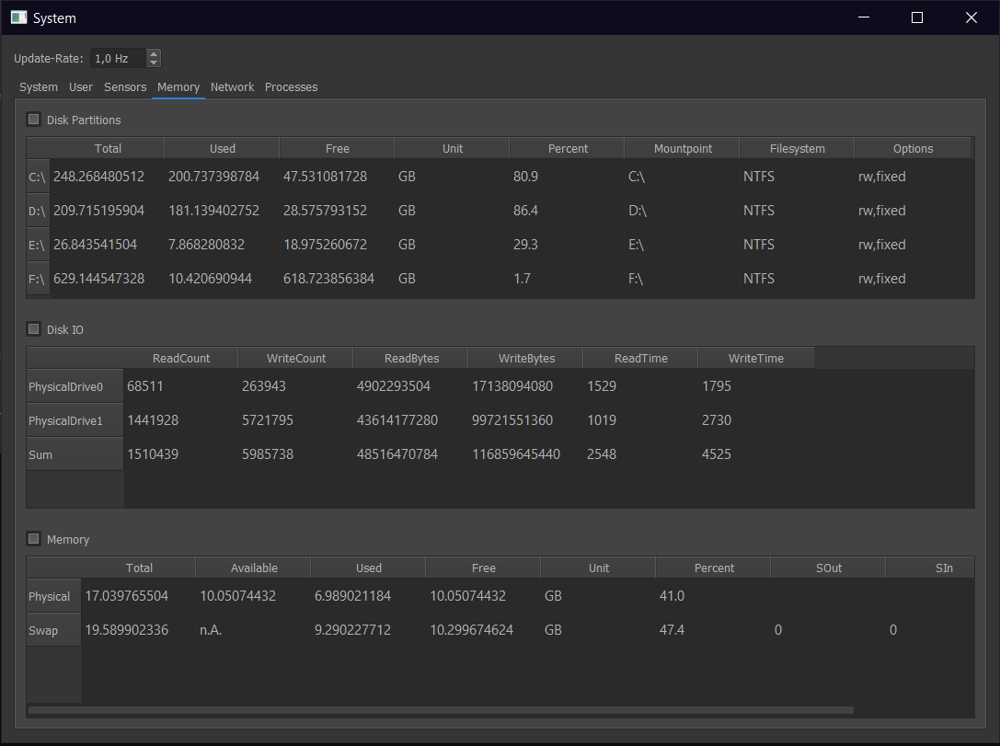
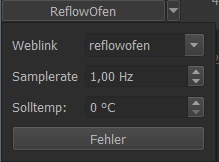
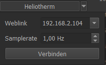

Writing Plugins
===================================================
To integrate a new device, you have to program your own plugin.

Each user-plugin must be stored in the user-directory ``~/.RTOC/devices/``. Each plugin must have its own folder.

Plugins are written in Python3 and need to follow some rules:
  from LoggerPlugin import LoggerPlugin # contains all plugin-functions

  class Plugin(LoggerPlugin):  # This must be the main class of your function
  	def __init__(self, stream=None, plot= None, event=None):
          super(Plugin, self).__init__(stream, plot, event))

          # start your code here

The above lines **must** be copied exactly into the plugin!

All functions and parameters defined in the main class are available for scripts. To prevent them from being displayed in the Script Help (and Telegram-bot), parameters and functions must begin with '_'.

Refer to :mod:`RTOC.LoggerPlugin` for a full list of available functions.

The following example plugin sends data to RTOC every second and loads an empty GUI::
  # This template shows, how to implement plugins in RTOC
  # RTOC version 2.0

  # A plugin needs to import RTOC.LoggerPlugin to be recognized by RTOC.
  from RTOC.LoggerPlugin import LoggerPlugin

  import sys
  import time
  from PyQt5 import uic
  from PyQt5 import QtWidgets
  import numpy as np

  DEVICENAME = "Template"  # Define the name of this Device

  AUTORUN = True  # If true, the thread to collect data will run right after initializing this plugin
  SAMPLERATE = 1  # The thread,which is supposed to collect data will be executed with 1 Hz

  class Plugin(LoggerPlugin):
    def __init__(self, stream=None, plot=None, event=None):
      # Plugin configuration
      # Call this to initialize RTOC.LoggerPlugin
      super(Plugin, self).__init__(stream, plot, event)
      # Set a default devicename.
      # This will be used for all signals sent by this plugin as default
      self.setDeviceName(DEVICENAME)

      # GUI configuration
      self.smallGUI = True  # Only cares, if your Plugin has a GUI

      self._firstrun = True

      # set the function, which will collect data periodically
      self.setPerpetualTimer(self._updateT, samplerate=SAMPLERATE)
      if AUTORUN:
        self.start()
        # start the configured perpetual timer. It can be stopped with 'self.cancel()'

      # Instead of this, you can also start a normal thread, which is active in this while loop: 'while self.run:'. This ensures, that this plugin can be stopped.

    # This function is being called in a thread.
    def _updateT(self):
      y1 = np.sin(time.time())
      y2 = np.cos(time.time())
      # Do something, collect data ,...

      # Then send your data
      self.stream([y1, y2], snames=['Sinus', 'Cosinus'], unit=["kg", "m"])  # send data to RTOC

      # You can also plot data like this:
      self.plot([-10, 0], [2, 1], sname='Plot', unit='Wow')

      # Or send an event with self.event(text='',sname='')
      # (but use with caution, it can spam your RTOC plots):
      if self._firstrun:
        self.event('Test event', sname='Plot', id='testID')
        self._firstrun = False

    # This function is used to initialize a own Plugin-GUI,
    # which will be available in RTOC.
    # Remove it, if you don't want a GUI for your plugin.
    def loadGUI(self):
      self.widget = QtWidgets.QWidget()  # Create an empty QWidget
      packagedir = self.getDir(__file__)  # Get filepath of this file
      # Load a GUI designed with QDesigner
      uic.loadUi(packagedir+"/Template/template.ui", self.widget)
      return self.widget  # This function needs to return a QWidget

  # Sometimes you want to use plugins standalone also. Very useful for testing.
  hasGUI = True  # If your plugin has a widget do this

  if __name__ == "__main__":
      if hasGUI:
          app = QtWidgets.QApplication(sys.argv)
          myapp = QtWidgets.QMainWindow()

      widget = Plugin()

      if hasGUI:
          widget.loadGUI()
          myapp.setCentralWidget(widget.widget)

          myapp.show()
          app.exec_()

      widget.run = False

      sys.exit()

Plugin repository
==========================

`This repository <https://github.com/Haschtl/RTOC-Plugins>`_ contains some plugins for RealTime OpenControl (RTOC).

Installing plugins
----------------------------
You can either install plugins manually or - if you are using the GUI - you can install it with the built-in installer: :ref:`Plugin-Downloader`

Manually
+++++++++++++++++++++++++++++
To add a plugin to RTOC you need to do the following steps:

1. Install RTOC (`pip3 install RTOC`)
   - You will need to run RTOC once
2. Copy the folder of the desired plugin to your RTOC-Userpath: `~/.RTOC/devices/`
3. Now restart RTOC (`python3 -m RTOC`)

List of plugins
--------------------------------

- Template: An example, showing how to create a simple plugin to send data to RTOC

- DPS5020: Plugin for DPS powersupplies. It can monitor all data and you can set Voltage, Current and switch it on/off. Uses USB to read data.
- Funktionsgenerator: Default-plugin of RTOC. Generates common signals.
- holdPeak_VC820: Plugin for VC820 multimeters. It can monitor the measured values with correct units. Uses USB/Minimalmodbus to read data.
- INA219_Modul: Plugin for INA219 solar module. Monitors voltage, current, power and shunt_voltage
- Octotouch: Plugin for 3D-printer-software Octotouch. It can just monitor the temperatures. Uses HTTP/JSON to read data.
- PIKO_Solarmodules: Plugin for PIKO solar modules. Monitors voltage, current and power
- System: Plugin to monitor system-information like CPU, Memory, ...
- ReflowOfen/ReflowPlatte: Plugin, which reads data from local network-devices HTTP-address.
- Heliotherm: Plugin, which reads data from Heliotherm heat pump using TCP/Modbus.
- Futtertrocknung: Embedded-Plugin. Plugin, which is used to run on a RaspberryPi. Monitors some sensor-data.

Plugin descriptions
---------------------------

Template
++++++++++++++++++++

**GUI**: Yes, if you want to

**Dependencies**: -

**Info**: Use this plugin as a starting point

DPS5020
++++++++++++++++++++

**GUI**: Yes

**Dependencies**: `pip3 install minimalmodbus`

**Target system**: Each OS (connected to DPS with USB)

**Info**:

- You can set a parameters in file DPS5020.py:
  - default_device = '/dev/ttyUSB0'
  - SERIAL_BAUDRATE = 9600
  - SERIAL_BYTESIZE = 8
  - SERIAL_TIMEOUT = 2
- You will need to run RTOC as root unless you set devices rules. See [this tutorial](http://ask.xmodulo.com/change-usb-device-permission-linux.html) for how to set device rules.

Generator
++++++++++++++++++++

**GUI**: Yes

**Dependencies**: -

**Target system**: Each OS

**Info**:

holdPeak_VC820
++++++++++++++++++++

**GUI**: Yes

**Dependencies**: `pip3 install serial`

**Target system**: Each OS (connected to VC820 with USB)

**Info**:

- You can set a parameters in file HoldPeak VC820.py:
  - default_device = 'COM7'
  - SERIAL_BAUDRATE = 2400
  - SERIAL_BYTESIZE = 8
  - SERIAL_TIMEOUT = 1
- You will need to run RTOC as root unless you set devices rules. See [this tutorial](http://ask.xmodulo.com/change-usb-device-permission-linux.html) for how to set device rules.

INA219_Modul
++++++++++++++++++++

**GUI**: No

**Dependencies**: `pip3 install pi-ina219`

**Target system**: RaspberryPi (connected to INA219 via I2C)

**Info**:

- You can set a parameters in file INA219_Modul.py:

  - SHUNT_OHMS = 0.1
  - MAX_EXPECTED_AMPS = 0.2

  - SAMPLERATE = 1/60# frequency in Hz (1/sec)
  - I2C_ADDRESS = 0x41

Octotouch
++++++++++++++++++++

**GUI**: Yes

**Dependencies**: -

**Target system**: Each OS (In same network as Octotouch-server)

**Info**:

You can set a parameters in file OctoTouch.py:

- devicename = "Octotouch"
- apikey = ""
- SAMPLERATE = 1

PIKO_Solarmodules
++++++++++++++++++++

**GUI**: No

**Dependencies**: `pip3 install lxml`

**Target system**: Each OS (In same network as PIKO modules)

**Info**:

- You can set a parameters in file INA219_Modul.py:
  - SAMPLERATE = 1/60# frequency in Hz (1/sec)
  - ADRESSES = ["IP1", "IP2", ...] #You can specify multiple adresses

System
++++++++++++++++++++

**GUI**: Yes

**Dependencies**: -

**Target system**: Each OS

**Info**:

ReflowOfen/ReflowPlatte
+++++++++++++++++++++++++++

**GUI**: Yes

**Dependencies**: -

**Target system**: Each OS

**Info**:

Heliotherm
++++++++++++++++++++

**GUI**: Yes

**Dependencies**: `pip3 install pyModbusTCP`

**Target system**: Each OS (In same network as Heliotherm heat pump)

**Info**:

Futtertrocknung
++++++++++++++++++++

**GUI**: No

**Dependencies**: `pip3 install adafruit_CCS811 adafruit_DHT board busio`

**Target system**: RaspberryPi

**Info**:
