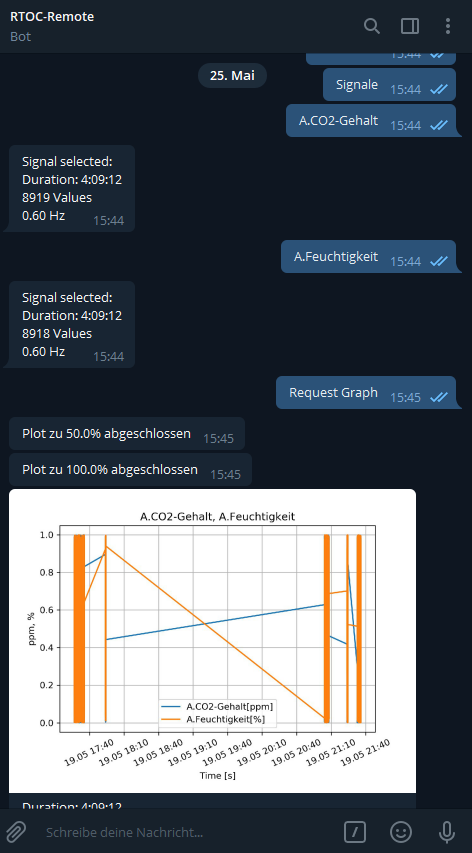

****************************
Telegram Communication
****************************

Telegram-Bot setup
----------------------------

Create a new Telegram-Bot
++++++++++++++++++++++++++++
- Telegram must be installed on Smartphone/PC,...
- Open the following website: `https://telegram.me/BotFather <https://telegram.me/BotFather>`_
- Click on 'SEND MESSAGE' (Telegram should open and create a new contact 'BotFather')
- Create a new bot with the command '/newbot
- Enter a name for the bot
- Enter a username for the bot
- You will receive a token which has to be entered in RTOC (looks like this: 123456789:AABBAABB66AA11_uGG22GH44AA55_3)

Configure RTOC for Telegram
+++++++++++++++++++++++++++++
You can eather configure it in the settings of the RTOC GUI or edit the :ref:`config.json` file by yourself. Enter your Bot-Token there and activate it  (``active=True``).

Mainmenu
------------

- <USER_ACTIONS>
- Set Event Notification
- Latest values
- Signals
- Devices
- Send event/signal
- Automation
- Settings (**only admin**)

Set Event Notification
++++++++++++++++++++++++

- Telegram-Notifications can be received from the RTOC-server if events occur. The notification level can be set here. (Averages, Warnings, Errors)

Latest values
+++++++++++++++++++++++

Displays the most current measured value of each signal.

Signals
++++++++++++++++++++++++

Contains a list of all signals. Clicking on a signal will select this signal. You can also select the time-period with ``Select period``. ``Generate plot`` will send you a plot with your selected signals in the selected period of time.

``Show/Hide events`` will show/hide events in the plot. Events are displayed as vertical lines with the event-text

``Delete signals`` (**only admin**) will delete all selected data (signals and time-period).

``Delete events`` (**only admin**) will delete all selected events (time-period).

Devices
+++++++++++++++++++++++

Contains a list of all devices/plugins found on the RTOc server (see submenu: Device).
  Device
  - Start/stop device
  - Functions: List of all device functions. Execute by click
  - Parameters: List of all device parameters: Edit by click
  - Change samplerate
  - *Info: You can create main-menu-shortcuts for functions and parameters*

Send event/signal
++++++++++++++++++++++

Create a new event with Telegram. You can send measurements, which your doing manually, too.

Automation
++++++++++++++++++++++

Editor for :ref:`Event/Action system`.

Settings
++++++++++++++++++++++

To get access to the settings, you need to connect your client with the bot once first and then stop RTOC. Then you need to edit the :ref:`config.json` at ``['telegram'][<CLIENT_ID>]['admin']=True``.

- Delete signals: Deletes all signals and events.
- Change recording length: Change the recording length of the server.
- Change global samplerate: Change the samplerate of all plugins using ``self.samplerate`` or ``self.setPerpetualTimer(func,samplerate)``.
- Restart server: Restart host computer
- Telegram clients: List of connected clients. Admins can change user-permissions.
- TCP-Server: On/Off: En/disable TCP-server

Telegram Custom-menu
-----------------------------
The file :ref:`telegramActions.json` contains dicts with actions, that will be shown in the main menu and can be executed by any user.

Here is an example to send a screenshot

.. code-block:: python

  {
	 "Screenshot": """

      import pyscreenshot as ImageGrab
      dir = self.config['global']['documentfolder']
      im = ImageGrab.grab()\nim.save(dir+'/telegram_overview.png')
      return 'picture', dir+'/telegram_overview.png'
      """

  }

A telegram action must return either a text, a picture or any other file.

``return 'text', 'My example text'`` to return a text message.

``return 'picture', <dir/to/picture.jpg>`` to return a picture.

``return 'document', <dir/to/file>`` to return any other file.
