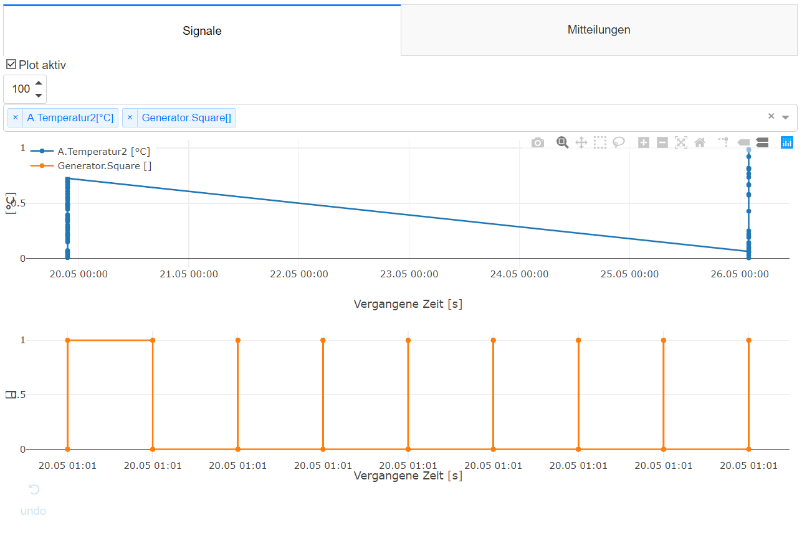
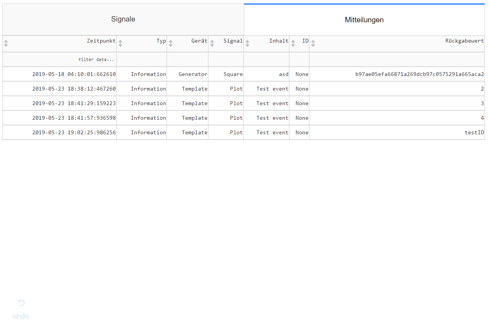

RTOC Webserver
================================

Since *v2.0* the webserver must be called with ``python3 -m RTOC.RTLogger -w``.

If you have enabled the postgreSQL database, the webserver will run standalone and read the data from the database only.

If you do not have enabled postgreSQL, RTOC will start with the webserver. Therefore, it's **not** possible to run GUI and webserver at the same time (without postgreSQL) !

The webserver is by default reachable on port 8050.
You can view the webpage from the same device with *http://localhost:8050* in any browser.
If you want to access the webpage from any other network device, you must know the IP-address or hostname.
For a RaspberryPi for example *http://raspberrypi:8050*.

Plots
-----------------------

Right beneath the tab-bar is the signal-selection field. You can select multiple signals, which will be plotted afterwards. Depending on the size of the signals, this can take some time. You can also plot only the latest X values by editing the number-edit left to the signal-selection field.

The webserver will automatically generate multiple figures for each unit.

Events
-----------------------

This tab shows a simple list of all events
